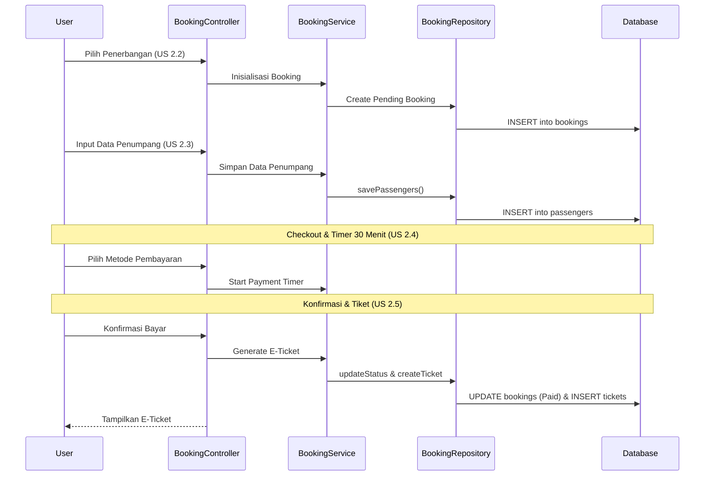

# Arsitektur Database & Alur Data (User Journey 2: Booking System)

Dokumen ini menjelaskan alur data dari permintaan HTTP hingga basis data untuk satu alur utama: **Proses Pemesanan/Booking (User Journey 2)**. Arsitektur ini merupakan pengembangan dari fitur pencarian sebelumnya dan tetap mengadopsi pola **MVC + Repository + Service Layer**.

## 1. Ringkasan Lapisan Arsitektur

Sistem memisahkan tanggung jawab setiap komponen agar kode tetap mudah diuji dan dikembangkan.

| Lapisan           | Peran                        | Komponen di Journey 2                       |
| :---------------- | :--------------------------- | :------------------------------------------ |
| **View**          | Antarmuka pengguna (Blade)   | Form Penumpang, Checkout, Success Page      |
| **Controller**    | Pengatur alur HTTP           | `BookingController`                         |
| **Form Request**  | Validasi input data (US 2.3) | `BookingRequest`                            |
| **Service Layer** | Logika bisnis & transaksi    | `BookingService`                            |
| **Repository**    | Operasi database (Eloquent)  | `BookingRepository`                         |
| **Model**         | Pemetaan tabel database      | `Booking`, `Passenger`, `Payment`, `Ticket` |

---

## 2. Desain Database (Pemesanan & E-Ticket)

Untuk mendukung US 2.2 hingga 2.5, sistem menambahkan 4 tabel baru yang berelasi dengan tabel jadwal penerbangan dari Journey sebelumnya.

- **`bookings`**: Menyimpan kode booking, total harga, dan status. Memiliki kolom `payment_expired_at` untuk mendukung **timer 30 menit (US 2.4)**.
- **`passengers`**: Menyimpan data identitas seperti **NIK (16 digit)** dan nama sesuai KTP (US 2.3).
- **`payments`**: Mencatat metode pembayaran dan status verifikasi transaksi (US 2.4).
- **`tickets`**: Diterbitkan secara otomatis setelah pembayaran lunas, menyimpan kode unik dan tautan PDF (US 2.5).

---

## 3. Alur Data (Sequence Diagram)

