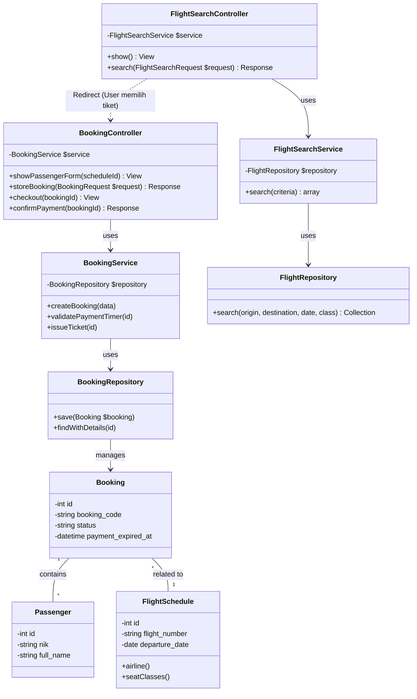

# Class Diagram - Journey 2 (Booking to E-Ticket)

Dokumen ini merinci struktur kelas untuk implementasi US 2.2 hingga 2.5, yang merupakan kelanjutan dari fitur pencarian (US 2.1).

## Mermaid Diagram

